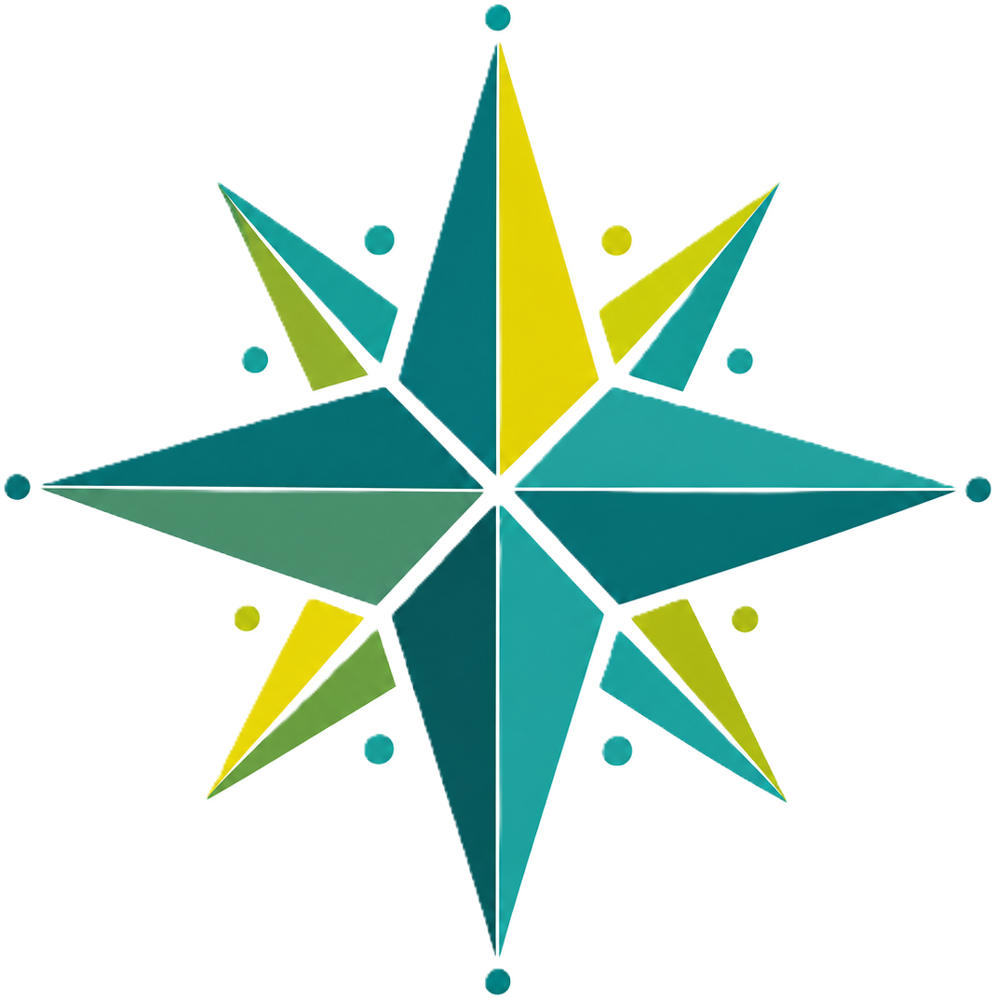
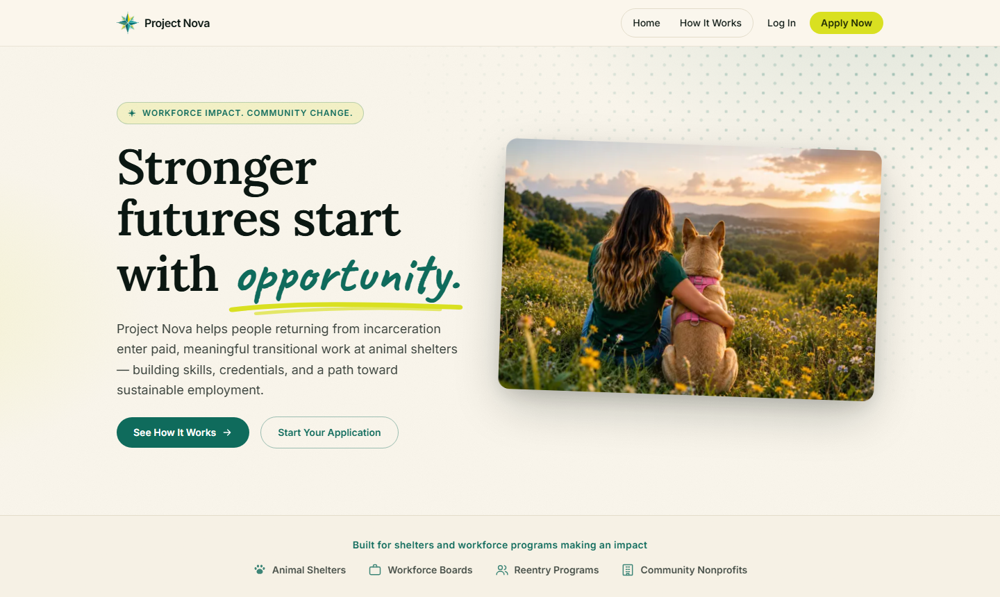
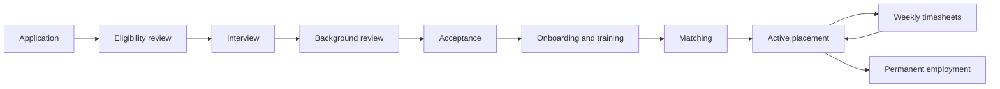
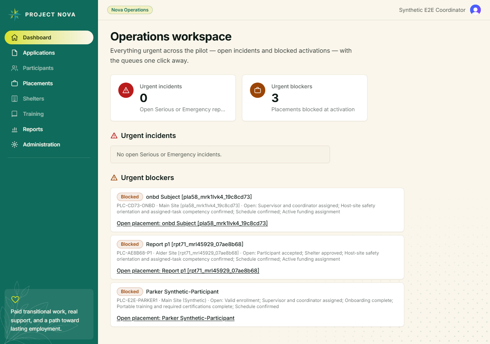
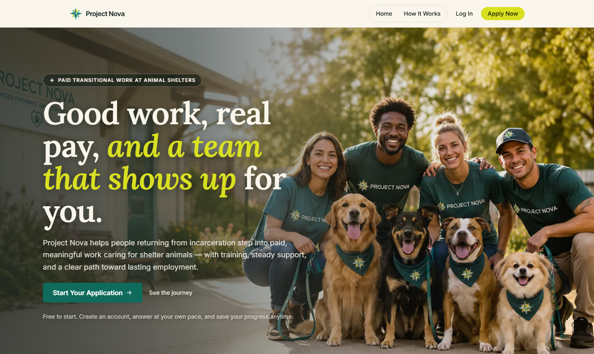

<div align="center">



# Project Nova

**Stronger futures start with opportunity.**

A workflow-driven case-management platform for grant-funded transitional employment —
helping people returning from incarceration step into paid, meaningful work caring for
shelter animals, and from there into lasting employment.

**[Live site → project-nova.app](https://project-nova.app)**

[](https://github.com/kithrine/project-nova/actions/workflows/ci.yml)

</div>



## What it does

Project Nova (or an approved employer-of-record partner) employs program participants;
partner animal shelters are host worksites. The platform runs the entire journey — from a
plain-language application through screening, onboarding, training, matching, and an
active placement with weekly approved hours, all the way to permanent-employment
outcomes — with grant-compliant reporting and a full audit trail underneath.



### One product, four experiences

| Experience              | Who                                    | What they see                                                                                                              |
| ----------------------- | -------------------------------------- | -------------------------------------------------------------------------------------------------------------------------- |
| **Participant**         | Applicants and placed participants     | A plain-language journey: save-as-you-go application, onboarding tasks, certifications, "My Placement," and "My Hours"     |
| **Operations**          | Program Coordinators, Nova admins      | Review queues, the placement workspace (the product's operational center), matching, incidents, case notes, reports, audit |
| **Shelter**             | Supervisors and Managers at host sites | Their organization's placements and weekly timesheet approvals — strictly scoped to their own organization                 |
| **Grant Administrator** | Funders' program staff                 | Funding assignment, approved-hours-by-funding-source, outcome summaries, and scoped exports                                |



_Operations workspace with synthetic fixture data. Every signed-in surface enforces
role- and organization-scoped authorization on the server._

## Design

The interface carries a warm, hand-crafted brand — cream paper, deep spruce ink, teal
primaries, and an electric chartreuse accent — with Lora display type, purposeful
motion (a red toy ball bounces across the How It Works page with paw prints trotting
after it), and photographic touches like a heart-masked shelter-yard portrait.

| Token      | Color                                                      | Use                         |
| ---------- | ---------------------------------------------------------- | --------------------------- |
| Cream      |  | Page canvas                 |
| Spruce     |  | Ink                         |
| Deep teal  |  | Primary, sidebar, tables    |
| Chartreuse |  | Accent (never ink on light) |
| Success    |  | Good-state badges           |
| Warning    |  | Needs-attention badges      |

Every animation is gated behind `prefers-reduced-motion`, every decorative element is
`aria-hidden`, and a custom contrast gate (`node scripts/check-contrast.mjs`) recomputes
39 color pairings — including alpha-composited badge tints — against WCAG AA on every
palette change. Content follows a trauma-informed
[style guide](docs/ux/content-style-guide.md): person-first language, no stigmatizing
terms, honest and plain wording throughout.



## Stack

| Layer      | Choice                                                                               |
| ---------- | ------------------------------------------------------------------------------------ |
| Framework  | [Next.js 16](https://nextjs.org) App Router (Turbopack), React 19, TypeScript strict |
| Styling    | Tailwind CSS 4 + DaisyUI theme tokens, CSS Modules for expressive motion             |
| Database   | [Neon](https://neon.tech) PostgreSQL via Prisma (driver adapter)                     |
| Auth       | [Clerk](https://clerk.com) — separate dev and production instances, webhook-synced   |
| Storage    | Vercel Blob (participant documents)                                                  |
| Validation | Zod at every server boundary                                                         |
| Testing    | Vitest + Testing Library, Playwright, axe-core                                       |
| Hosting    | Vercel — preview deploys per PR, protected production                                |

## Quality gates

Every pull request must pass, in CI and locally, before auto-merge:

- **Typecheck + lint + format** — TypeScript strict, ESLint, Prettier
- **Unit and integration tests** — 800+ Vitest tests across 130 files
- **Contrast gate** — 39 WCAG AA pairings recomputed from the live tokens
- **End-to-end suite** — 79 Playwright tests: full user journeys for every role,
  authenticated accessibility sweeps (axe), organization-boundary security tests,
  and 360-px mobile layout checks
- **Production build** and a Vercel preview deployment

## Getting started

Prerequisites: Node 20+, a [Neon](https://neon.tech) Postgres database, and a
[Clerk](https://clerk.com) development instance.

```bash
git clone https://github.com/kithrine/project-nova.git
cd project-nova
npm install                 # postinstall runs prisma generate

cp .env.example .env        # fill in DATABASE_URL, Clerk keys, Blob token
npm run db:migrate          # apply migrations
npm run db:seed             # seed baseline data

npm run dev                 # http://localhost:3000
```

| Script                                         | What it does                                 |
| ---------------------------------------------- | -------------------------------------------- |
| `npm run dev` / `build` / `start`              | Develop / build / serve                      |
| `npm run test` / `test:watch`                  | Vitest suite                                 |
| `npm run e2e`                                  | Playwright suite (starts its own dev server) |
| `npm run typecheck` / `lint`                   | TypeScript / ESLint                          |
| `node scripts/check-contrast.mjs`              | WCAG AA contrast gate                        |
| `npm run db:migrate` / `db:seed` / `db:studio` | Prisma workflows                             |

Local development and Vercel previews share a **nonproduction** database and Clerk
instance; production has its own isolated database, secrets, and Clerk instance
([environments](docs/architecture/environments.md),
[ADR-006](docs/decisions/ADR-006-shared-nonproduction-db.md)).

## Documentation

The repository is documentation-first — decisions, rules, and specs live next to the code:

| Where                                                   | What                                                                                          |
| ------------------------------------------------------- | --------------------------------------------------------------------------------------------- |
| [`PROJECT_CONTEXT.md`](PROJECT_CONTEXT.md)              | Mission, operating model, users, experiences                                                  |
| [`docs/product/`](docs/product/)                        | PRD, MVP scope, lifecycles, business rules, glossary                                          |
| [`docs/architecture/`](docs/architecture/)              | Stack, domain model, database, auth/RBAC, testing strategy, CI/CD, security                   |
| [`docs/ux/`](docs/ux/)                                  | Information architecture, flows, visual design reference, component guidelines, accessibility |
| [`docs/decisions/`](docs/decisions/)                    | Architecture decision records (ADR-001 onward)                                                |
| [`docs/ops/`](docs/ops/)                                | Pilot operations, incident handling, grant operations                                         |
| [`RULES.md`](RULES.md) / [`DECISIONS.md`](DECISIONS.md) | Standing engineering rules and the decision log                                               |
| [`TERMINOLOGY.md`](TERMINOLOGY.md)                      | Canonical domain vocabulary                                                                   |
| [`AGENTS.md`](AGENTS.md)                                | Working agreements for AI-assisted development                                                |

## About

Project Nova is a capstone project by **Kit Tensfeldt**, built with AI-assisted
development under human review — every change lands through a pull request that passes
the full quality battery. The program it models operates in Colorado; policy research
and compliance notes live in the ADRs.

<div align="center">

_Building pathways. Strengthening communities. Changing lives._

</div>
